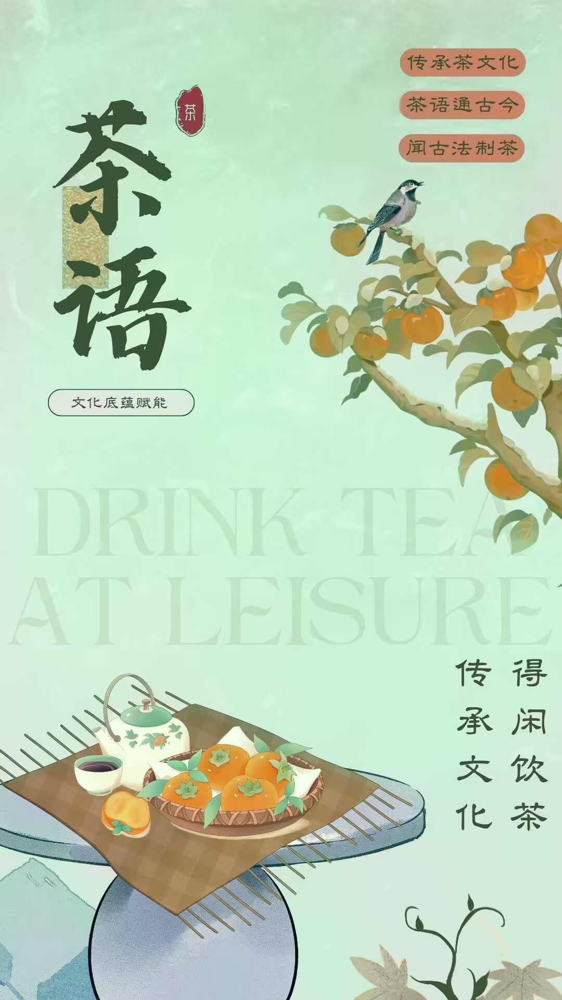

# 茶语 / whispers_of_tea

一款介绍中国制茶历史、宣传茶艺文化、带动茶叶市场及其衍生产业发展的茶文化传播APP。

## Getting Started

This project is a starting point for a Flutter application.

A few resources to get you started if this is your first Flutter project:

- [Lab: Write your first Flutter app](https://docs.flutter.dev/get-started/codelab)
- [Cookbook: Useful Flutter samples](https://docs.flutter.dev/cookbook)

For help getting started with Flutter development, view the
[online documentation](https://docs.flutter.dev/), which offers tutorials,
samples, guidance on mobile development, and a full API reference.

## 预览 / Preview

## 开发环境 / Development Environment

* Dart 3.0.1
* Flutter 3.10.1

## 安装包下载 / Install

* Android: [releases](https://github.com/PrinceSaoKe/whispers_of_tea/releases/download/1.0.1%2B1/whispers_of_tea.apk)
* iOS: 暂无